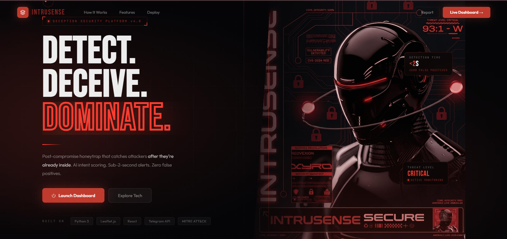
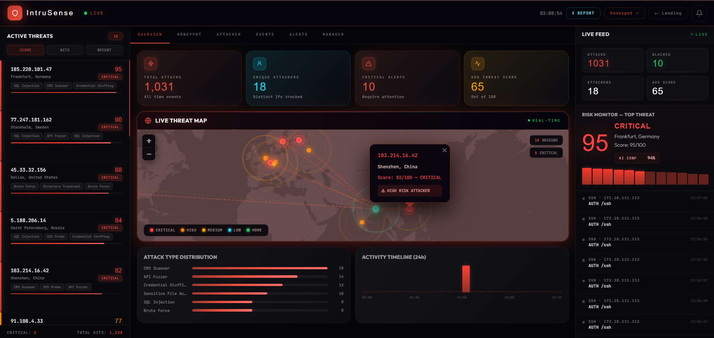
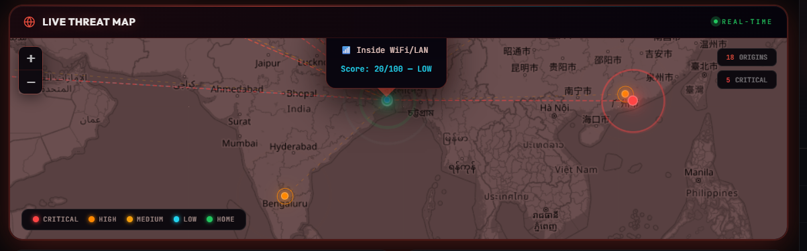

<div align="center">

<br/>

```
██╗███╗   ██╗████████╗██████╗ ██╗   ██╗███████╗███████╗███╗   ██╗███████╗███████╗
██║████╗  ██║╚══██╔══╝██╔══██╗██║   ██║██╔════╝██╔════╝████╗  ██║██╔════╝██╔════╝
██║██╔██╗ ██║   ██║   ██████╔╝██║   ██║███████╗█████╗  ██╔██╗ ██║███████╗█████╗  
██║██║╚██╗██║   ██║   ██╔══██╗██║   ██║╚════██║██╔══╝  ██║╚██╗██║╚════██║██╔══╝  
██║██║ ╚████║   ██║   ██║  ██║╚██████╔╝███████║███████╗██║ ╚████║███████║███████╗
╚═╝╚═╝  ╚═══╝   ╚═╝   ╚═╝  ╚═╝ ╚═════╝ ╚══════╝╚══════╝╚═╝  ╚═══╝╚══════╝╚══════╝
```

### *They think they found something. We know exactly who they are.*


> **CS 007 Hackathon Entry** — Deception-Based Intrusion Detection for Small Businesses

<br/>

---

</div>

## 🎯 What Is IntruSense?

IntruSense is a **honeypot-first, AI-powered security platform** that turns your server into a trap.

Instead of building higher walls, we do the opposite: we plant **fake credentials, fake admin panels, fake database backups, and fake `.env` files** across your server. The moment an attacker touches one — we know. We profile them. We alert you in plain English.

No false positives. No alert fatigue. Just confirmed, real intrusions.

```
Traditional Security:  🏰 Build walls → Hope attackers bounce off
IntruSense:            🪤 Plant traps → Catch attackers in the act
```

## 🌐 🔴 Live Product Access

> *Try it yourself — no setup needed*

🚀 **Landing Page**  
👉 https://intrusense-rose.vercel.app  

📊 **Live Dashboard**  
👉 https://intrusense-rose.vercel.app/dashboard  

---

## 📸 Screenshots

### 🏠 Landing Page
> *Cinematic dark UI with animated threat visualization*

<!-- Replace with actual screenshot -->


> **What you see:** Custom cursor, animated particle field, real-time threat counter, smooth section transitions, and a live demo embedded in the hero section.

---

### 📊 Live Dashboard
> *Real-time attacker profiling, world threat map, AI-powered summaries*

<!-- Replace with actual screenshot -->


> **What you see:** Live Socket.io feed of attacker events, interactive Leaflet.js world map with threat pins, per-attacker profiles with threat scores (0–100), AI plain-English explanations, and smart grouped notifications.

---

### 🗺️ Threat Intelligence Map
> *Local LAN attackers plotted on Kolkata, external threats geolocated globally*

<!-- Replace with actual screenshot -->


---

## 🎬 Demo Video

[](https://youtu.be/Ha1AR0Ly7Lk?si=uv_iGAaBpOIKVltC)

> *7-minute pitch walkthrough: problem statement → live demo → architecture → business case*

---

## 🔴 The Problem We Solve

```
📊 207 days   — Average time a breach goes undetected
💸 ₹40 Lakhs  — Annual cost of enterprise SIEM (too expensive for SMEs)
🚨 1000s/day  — False positives from traditional IDS (alert fatigue)
😶 97%        — Indian SMEs with zero active security monitoring
```

**The gap:** Most security tools guard the front door. IntruSense watches what happens *after* an attacker gets in.

---

## 🪤 How The Trap Works

```
┌──────────────────────────────────────────────────────────────┐
│                    THE BREADCRUMB CHAIN                      │
├──────────────────────────────────────────────────────────────┤
│                                                              │
│  1. Attacker finds your server                               │
│              ↓                                               │
│  2. Hits /wp-login.php → sees "WordPress admin panel"        │
│     (Fake — every keystroke logged)                          │
│              ↓                                               │
│  3. Tries /.env → downloads "production credentials"         │
│     (Fake — CANARY TRIGGERED 🚨)                            │
│              ↓                                               │
│  4. Finds /backup.zip → "database backup"                    │
│     (Fake — download tracked)                                │
│              ↓                                               │
│  5. Hits /api/v1/users → "employee data"                     │
│     (Fake — IP, headers, timing all captured)                │
│              ↓                                               │
│  6. You get: IP, country, ISP, tool used, attack type,       │
│     credentials they tried, threat score — all in real-time  │
│                                                              │
└──────────────────────────────────────────────────────────────┘
```

Every step keeps the attacker engaged. Every step reveals more about them.

---

## 🛠️ Architecture

```
┌──────────────────────────────────────────────────────────────────┐
│                     INTRUSENSE PLATFORM                          │
├─────────────────────────┬────────────────────────────────────────┤
│      HONEYPOT LAYER     │          INTELLIGENCE LAYER            │
│                         │                                        │
│  🌐 HTTP  (port 8080)   │  📍 geoip-lite  → offline geo lookup  │
│   ├─ /login             │  🧠 Threat Score → weighted 0-100      │
│   ├─ /wp-login.php      │  🔍 Attack Class → 15+ pattern types   │
│   ├─ /admin             │  🤖 AI Summary   → plain English       │
│   ├─ /.env  🪤 CANARY   │  🗺️  Map Coords  → LAN → Kolkata      │
│   ├─ /backup.zip 🪤     │                                        │
│   ├─ /phpmyadmin        ├────────────────────────────────────────┤
│   └─ /api/v1/users      │           ALERT ENGINE                 │
│                         │                                        │
│  🔒 SSH   (port 2222)   │  Smart Grouping: same IP+type in 1min  │
│   └─ fake banner/shell  │  → increment count (no flood)          │
│                         │  → 2min silence → fresh alert          │
│  📁 FTP   (port 2121)   │  → different attack → new notif       │
│   └─ fake vsFTPd        │                                        │
├─────────────────────────┴────────────────────────────────────────┤
│                    DATABASE (SQLite)                             │
│        events • attacker_profiles • alerts                       │
├──────────────────────────────────────────────────────────────────┤
│              DASHBOARD (React 18 + Vite + Socket.io)             │
│   Live Map • Attacker Feed • AI Summaries • Smart Alerts         │
└──────────────────────────────────────────────────────────────────┘
```

---

## ⚡ Tech Stack

| Layer | Technology | Why |
|---|---|---|
| **Backend** | Node.js + Express | Non-blocking I/O — perfect for honeypot connections |
| **Realtime** | Socket.io | Sub-100ms dashboard updates |
| **Database** | SQLite (better-sqlite3) | Zero-config, embedded, no separate service |
| **GeoIP** | geoip-lite | Offline IP lookup — no API key needed |
| **Frontend** | React 18 + Vite | Fast hot-reload, component-based dashboard |
| **Maps** | Leaflet.js | Lightweight, self-hosted, no API key |
| **Deployment** | Docker Compose | One command, any Linux server |

---

## 🚀 Quick Start

### Option 1: Docker (Recommended)

```bash
git clone https://github.com/your-org/intrusense.git
cd intrusense
docker-compose up -d
```

**That's it.** Dashboard at `http://localhost:5173` — Honeypots active on ports 8080, 2222, 2121.

---

### Option 2: Manual

```bash
# Backend
cd backend
npm install
node server.js

# Frontend (separate terminal)
cd frontend
npm install
npm run dev
```

---

### Option 3: Demo Mode (No real attackers needed)

```bash
DEMO_MODE=true docker-compose up -d
```

Injects 50+ simulated attacker events so you can explore the full dashboard immediately.

---

## 🔥 Features

### 🪤 Deception Layer
- **7 fake trap pages** — corporate login, WordPress admin, phpMyAdmin, .env, backup.zip, API endpoints
- **3 protocol honeypots** — HTTP, SSH, FTP running simultaneously
- **Psychological breadcrumb chain** — each page references the next, keeping attackers engaged

### 🧠 Intelligence Engine
- **Threat Score 0–100** — weighted across: abuse history, attack patterns, Tor usage, datacenter origin, credential stuffing
- **15+ attack pattern classifiers** — SQL Injection, XSS, Directory Traversal, Brute Force, Canary Access, and more
- **Tool fingerprinting** — identifies Nmap, Masscan, curl, Python scripts, etc.
- **Local vs External** — detects LAN attackers and maps them to your city

### 💬 AI Plain-English Summaries
No security jargon. Just human-readable explanations:

| What happened | What IntruSense tells you |
|---|---|
| SQL Injection detected | *"Someone is trying to trick your database into revealing secret data by typing malicious commands into form fields."* |
| /.env accessed | *"A trap was triggered: someone accessed a fake decoy file we planted. This is a confirmed intruder already inside your system."* |
| Brute force SSH | *"Someone is rapidly guessing your SSH password using automated tools — tried 47 times in 60 seconds."* |
| Port scan detected | *"Someone is checking what network services your device has open — like rattling door handles before breaking in."* |

### 📊 Dashboard
- **Live world map** — attackers geolocated in real-time
- **Per-attacker profiles** — full timeline, credentials tried, tools used
- **Smart notifications** — grouped by IP + attack type to prevent alert fatigue
- **Attack feed** — scrolling live event stream with protocol, path, and classification

---

## 📁 Project Structure

```
intrusense/
├── backend/
│   ├── server.js              ← Main entry: API + all 3 honeypots
│   ├── honeypot-pages.js      ← All fake trap pages (HTML)
│   ├── alert-engine.js        ← Smart alerts + AI summaries
│   ├── capture-pipeline.js    ← Threat scoring + attack classification
│   ├── database.js            ← SQLite queries
│   └── demo-seed.js           ← Demo data generator
├── frontend/
│   └── src/
│       ├── components/
│       │   ├── Landing.jsx    ← Marketing/product landing page
│       │   └── Dashboard.jsx  ← Live security dashboard
│       └── hooks/
│           └── useSocket.js   ← Socket.io React hook
├── attacker-sim/              ← 8 attack simulation scripts
│   ├── 01_recon_portscan.sh
│   ├── 02_web_fuzzing.sh
│   ├── 05_brute_force_ssh.sh
│   ├── 07_canary_trap.sh
│   └── run_all_attacks.sh
├── docs/
│   ├── ARCHITECTURE.md
│   └── PRESENTATION_SPEECH.md
└── docker-compose.yml
```

---

## 🎯 Competitive Advantage

| Capability | Traditional IDS | Enterprise SIEM | **IntruSense** |
|---|---|---|---|
| False positives | Thousands/day | Hundreds/day | **Zero** (by design) |
| Post-breach detection | ❌ Blind | ✅ Yes | **✅ Yes** |
| Plain English alerts | ❌ | ❌ | **✅ Built-in** |
| Local network threats | Partial | Yes | **✅ Yes** |
| Setup time | Weeks | Months | **5 minutes** |
| Cost | ₹5-15L/year | ₹40-80L/year | **Open Source** |
| Non-technical friendly | ❌ | ❌ | **✅ Yes** |

---

## 🧪 Test The Traps

```bash
# Trigger canary file access
curl http://localhost:8080/.env

# Simulate brute force
for i in {1..10}; do
  curl -s -X POST http://localhost:8080/login \
    -d "username=admin&password=password$i" > /dev/null
done

# SSH probe
ssh -p 2222 root@localhost

# FTP probe
ftp localhost 2121
```

Watch the dashboard light up in real-time.

---

## 🗺️ Roadmap

```
Phase 1 (Done ✅)
  ✅ HTTP / SSH / FTP honeypots
  ✅ Real-time React dashboard
  ✅ Plain-English summaries
  ✅ Threat scoring engine
  ✅ Smart notification grouping
  ✅ Docker deployment

Phase 2 (3 months)
  ⬜ Telegram / WhatsApp real-time alerts
  ⬜ Auto-block attacking IPs via firewall rules
  ⬜ PDF security reports (one-click)
  ⬜ Webhook export to Splunk / ELK / Grafana

Phase 3 (6 months)
  ⬜ Active deception — fake data that phones home when exfiltrated
  ⬜ MITRE ATT&CK framework mapping
  ⬜ ML-based anomaly detection
  ⬜ Multi-tenant SaaS

Phase 4 (12 months)
  ⬜ Hardware sensor (plug-in device)
  ⬜ IoT honeypots (fake cameras, routers, printers)
  ⬜ Global threat intelligence sharing network
```

---

## 💼 Business Case

```
🌍 Market Size:    $1.9 billion honeypot market by 2029 (CAGR 17%)
🏭 Target:         500,000+ Indian SMEs with zero security monitoring
💰 Pricing:        ₹2,999/month vs ₹40,00,000/year (enterprise SIEM)
🎯 GTM:            IT service providers / MSPs as channel partners
```

---


## 📜 License

MIT License — use freely, deploy anywhere, contribute back.

---

<div align="center">

<br/>

```
The attacker thinks they found gold.
We know their IP, country, ISP, tools, and every move they've made.
```

**Built with 🔴 to protect those who can't afford to be breached.**

<br/>
<br/>

*IntruSense — Because the best security isn't a wall. It's a trap.*

</div>
